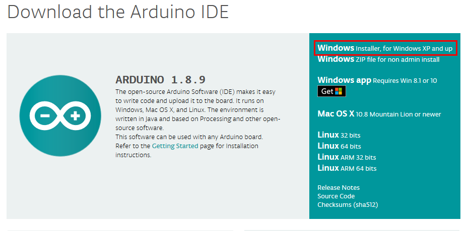

# AOT WebServer for ESP32

### Project made with [Arduino IDE](https://www.arduino.cc/en/Main/Software) and [Espressif arduino-esp32](https://github.com/espressif/arduino-esp32) libraries.

## Contents

  - [Installation Instructions](#installation-instructions)
    + [Arduino IDE](#arduino-ide-windows-installation)
    + [Espressif arduino-esp32 libraries](#espressif-arduino-esp32-libraries)
  - [Testing](#testing)
  - [Adding Functionalities](#adding-functionalities)
    + [Adding More Pages](#adding-more-pages)
   
## Installation Instructions

### Arduino IDE (Windows Installation)

Go to the [Arduino IDE official website](https://www.arduino.cc/en/Main/Software), in the "Download the Arduino IDE" section, choose the Windows installer option.

### Espressif arduino-esp32 libraries
