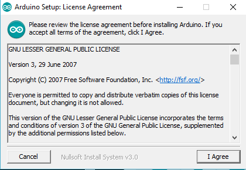
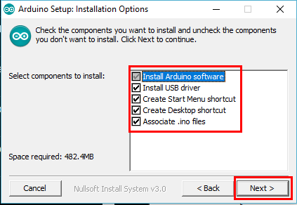
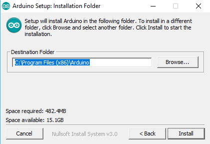
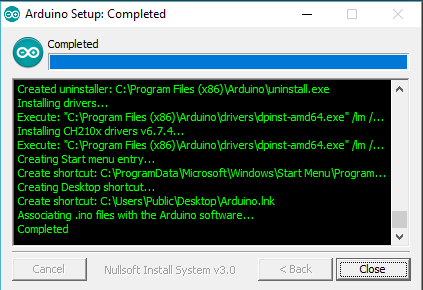
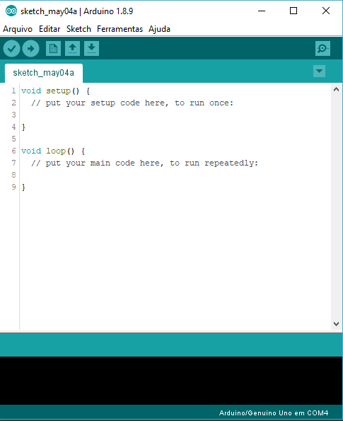
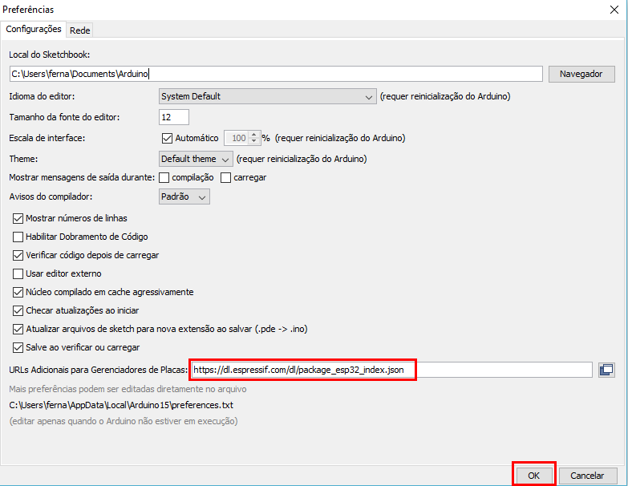
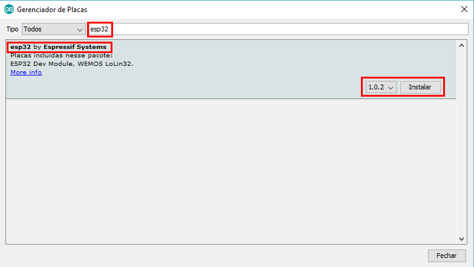
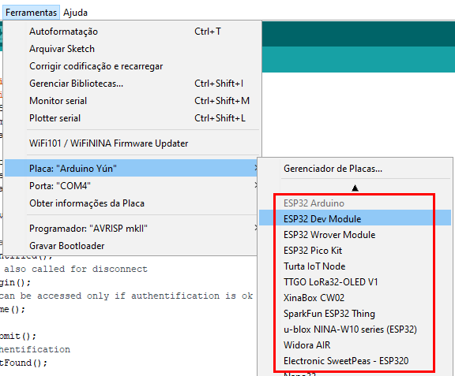

AOT WebServer for ESP32
=======================

### Project made with [Arduino IDE](https://www.arduino.cc/en/Main/Software) and [Espressif arduino-esp32](https://github.com/espressif/arduino-esp32) libraries.

Contents
--------

-	[Installation Instructions](#installation-instructions)
	-	[Arduino IDE](#arduino-ide-windows-10-installation)
	-	[Espressif arduino-esp32 libraries](#espressif-arduino-esp32-libraries)
-	[Testing](#testing)
-	[Adding Functionalities](#adding-functionalities)
	-	[Adding More Pages](#adding-more-pages)

Installation Instructions
-------------------------

### Arduino IDE (Windows 10 Installation)

-	Go to the [Arduino IDE official website](https://www.arduino.cc/en/Main/Software), in the "Download the Arduino IDE" section, choose the Windows installer option

-	Launch the Installer, agree with the License Agreement

-	Leave all the installation options marked then click "Next"

-	Select an installation folder and click "Install"

-	Wait until the installation is completed then click "Close"

-	In the Windows 10 search bar, search for "Arduino", launch the .exe found then the Arduino IDE will launch

 

If the Arduino IDE doesn't launch properly, contact the Arduino IDE development team or community with [one of these methods](https://www.arduino.cc/en/Main/ContactUs).

### Espressif arduino-esp32 libraries

We're going to use Arduino IDE's Board Manager to install the Espressif arduino-32 libraries.

-	Open the Arduino IDE, go to File->Preferences , then paste this in "Board Manager Additional URL's": [https://dl.espressif.com/dl/package_esp32_index.json](https://dl.espressif.com/dl/package_esp32_index.json) ; then click "OK"

-	Back at Arduino IDE, go to Tools->Board->Board Manager , in the search bar type "esp32", the first result should be "esp32 by Espressif Systems". Install this board package

-	Now, you should be able to select an ESP32 board from the package in Tools->Board

